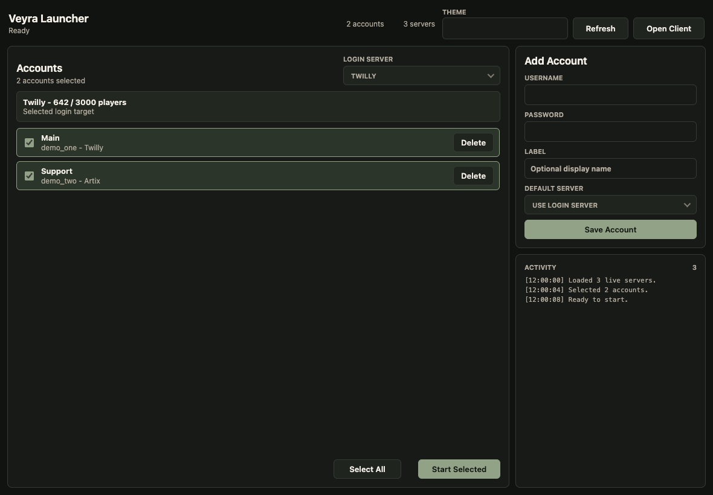

# Veyra

Veyra is a TypeScript-first desktop automation runtime with an Electron Flash client, typed bot APIs, script tooling, and a script-builder UI.



## What Is In This Repo

- `apps/flash-client`: the main Electron app with the embedded Flash client.
- `apps/flash-client/as3-client`: ActionScript source for `client.swf`.
- `packages/protocol`: shared JSON-RPC contracts.
- `packages/core`: bot API, settings, app paths, script catalog sync, and logging.
- `packages/runtime`: script lifecycle, cancellation, loading, and status.
- `packages/script-tools`: manifest generation and migration helpers.

## Runtime Dependencies

End users need:

- macOS or Windows x64.
- A PPAPI Pepper Flash plugin. Installing Artix Game Launcher is the easiest way to provide one.
- A downloaded Veyra release for their platform.

Developers also need:

- Git.
- Node.js 22 LTS or newer.
- pnpm 11.3.0. The repo is configured for Corepack, so `corepack enable` is enough on a normal Node install.
- Optional, only when rebuilding `client.swf`: Java plus Apache Flex SDK 4.16.1, with `FLEX_HOME` pointing at the SDK root or the SDK installed at `.toolchains/apache-flex-sdk-4.16.1-bin`.

Veyra needs a PPAPI Pepper Flash plugin, not an NPAPI browser plugin. If Veyra cannot auto-detect it, set:

```sh
export VEYRA_PEPPER_FLASH="/path/to/PepperFlashPlayer.plugin"
export VEYRA_PEPPER_FLASH_VERSION="32.0.0.371"
```

On Windows use a `pepflashplayer.dll` path instead.

## Run From Source

```sh
corepack enable
pnpm install
pnpm app
```

Useful checks:

```sh
pnpm typecheck
pnpm lint
pnpm test
```

## Package A Release Locally

Release packages are created by Electron Builder.

```sh
# macOS .dmg + .zip
pnpm app:dist:mac

# Windows NSIS installer + .zip
pnpm app:dist:win
```

Packaging normally expects a bundled Pepper Flash plugin under `apps/flash-client/vendor/pepper-flash/`.

```sh
pnpm flash:bundle
```

That folder is intentionally ignored by git. For local developer builds that rely on a system-installed plugin instead of bundling one:

```sh
VEYRA_ALLOW_EXTERNAL_FLASH=1 pnpm app:dist:mac
```

## Update Checks

Installed Veyra builds ping GitHub Releases on launch. Manual checks are available from `Veyra -> Check For Updates`, which opens the latest release download page when a newer app build exists.

Veyra does not auto-install updates and does not require an Apple Developer ID certificate.

## Script Updates

Veyra can update official automation script packs separately from the app. Use `Veyra -> Check For Script Updates` to poll the script manifest and install newer packs. `Options -> Application` includes an `Automatically download script updates` checkbox for launch-time script pack installs.

The built-in `Refresh List` button only rescans scripts that are already installed locally. It does not download from GitHub.

The default script update manifest lives at `script-updates/stable.json`. Publish script-only updates with a non-release commit, for example `chore(scripts): publish script pack`, so semantic-release skips app packaging.

## Release Versioning

Veyra uses semantic-release on pushes to `main`. Commit messages decide the next version:

- `fix: ...` creates a patch release.
- `feat: ...` creates a minor release.
- `feat!: ...` or a `BREAKING CHANGE:` footer creates a major release.

The workflow writes the computed version into the packaged app before building, then publishes a GitHub release tagged as `vX.Y.Z`. Commits that do not require a release skip the packaging jobs.

## How End Users Run Veyra

1. Download the latest release from GitHub Releases.
2. Install or extract the artifact for your platform:
   - macOS: open the `.dmg` or unzip the `.zip`, then launch `Veyra`.
   - Windows: run the installer `.exe`, or extract the `.zip` and launch `Veyra.exe`.
3. Install Artix Game Launcher if Veyra reports that Pepper Flash is missing.
4. Open Veyra Launcher, add an account, choose a login server, and click `Start Selected`.

## Data Locations

- Windows settings: `%APPDATA%\Veyra`.
- macOS settings: `~/Library/Application Support/Veyra`.
- Flash trust files are written automatically on launch.
